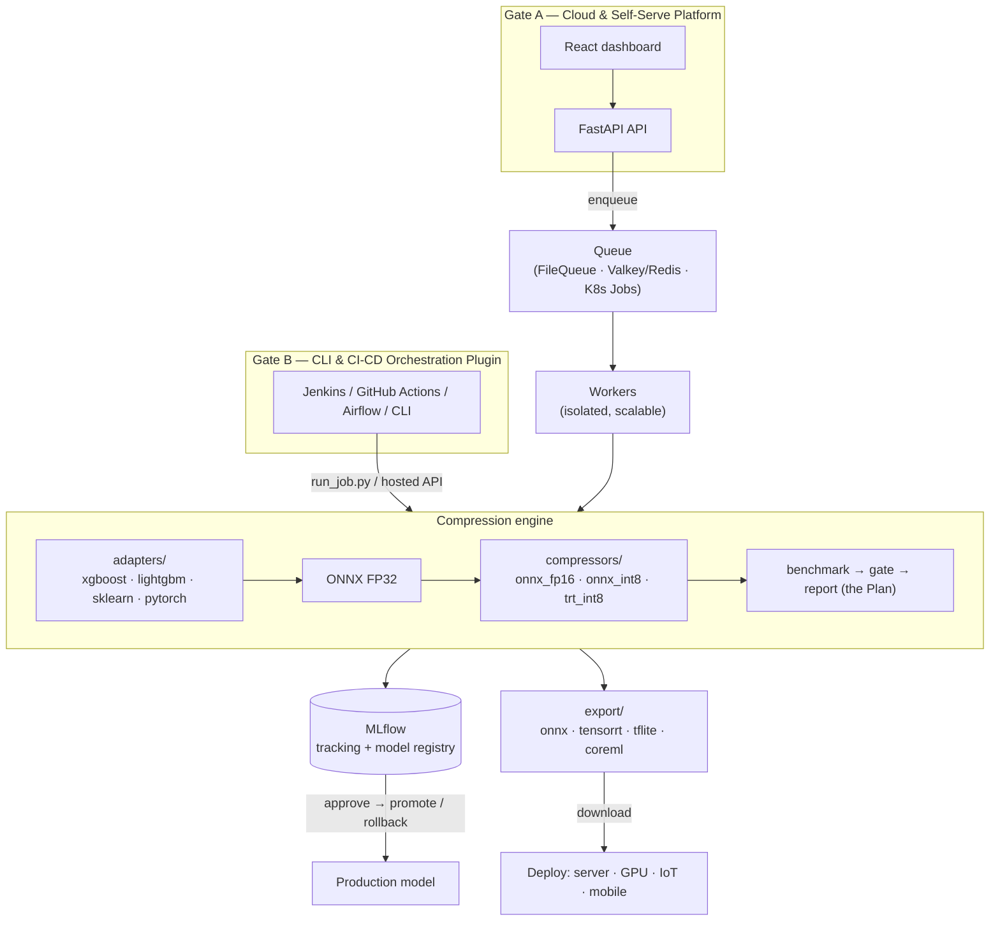

# Kompress

[](https://github.com/RichardLitt/standard-readme)
[](.github/workflows/ci.yml)
[](#license)
[](requirements.txt)

> A model-compression **platform** — compress any model (traditional ML or deep learning) for the hardware it will deploy to, review the trade-off, and ship it to production with human consent.

Kompress takes a trained model, its test set, and a **target hardware**, then compresses it every
applicable way (ONNX FP32, ONNX INT8, TensorRT, …), benchmarks the variants, gates on accuracy,
and produces a **"Plan"** — a report of the size / latency / accuracy deltas. On approval it
registers the winner in **MLflow** and lets you promote it to production or export it for the
target device (server, GPU/Jetson, IoT, mobile).

It exposes the same engine through **two entry gates**:

- **Gate A — Cloud & Self-Serve Platform.** A REST API + React dashboard where a human submits a
  model, reviews the Plan, and deploys on consent.
- **Gate B — CLI & CI-CD Orchestration Plugin.** Jenkins / GitHub Actions / Airflow / CLI call one command
  (`plugin/run_job.py`) or the hosted API to run compression as a pipeline stage.

## Architecture



**State lives in MLflow tags** — `pending_gate → pending_approval → approved | rejected | failed` —
so the review queue and approval flow need no separate database.

## Table of Contents

- [Background](#background)
- [Install](#install)
- [Usage](#usage)
  - [Gate A — Cloud & Self-Serve](#gate-a--cloud--self-serve)
  - [Gate B — CLI & CI-CD Plugin](#gate-b--cli--ci-cd-plugin)
- [API](#api)
- [Deploy](#deploy)
- [Supported models & compression](#supported-models--compression)
- [Repository layout](#repository-layout)

## Background

Model compression tools (ONNX Runtime, TensorRT, Sony MCT, …) are libraries you call from code —
they compress a graph but leave orchestration, benchmarking, accuracy gating, model storage,
approval, and deployment to you. Kompress wraps those libraries in a **pipeline** and turns them
into interchangeable backends: adapters bring any framework in, compressors are pluggable
techniques, a hardware map picks which to run, and the compressed model flows through
benchmark → gate → report → registry → deploy. The result is vendor- and hardware-neutral, and
every layer — including the compression libraries and MLflow — is open source.

## Install

**Local (Linux; developed on Arch):**

```bash
./run.sh              # sets up a venv + web deps, starts MLflow + API + worker + dashboard
./run.sh --with-dl    # also install PyTorch (CPU) + onnxscript for the DL path
```

Then open the **Dashboard** at http://localhost:5173 (API docs at http://localhost:8000/docs).

**Manual:**

```bash
python -m venv .venv && source .venv/bin/activate
pip install -r requirements.txt          # + requirements-deploy.txt for the cloud backends
( cd web && npm install )
```

Prerequisites on Arch: `sudo pacman -S python nodejs npm`.

## Usage

A **job** is described by a manifest — `{ model, test_data, target_hardware, gate }` — see
[`plugin/job.schema.json`](plugin/job.schema.json) and [`plugin/job.example.yaml`](plugin/job.example.yaml).
Only a **test set** is needed (no training data); features are auto-inferred from the test CSV.

### Gate A — Cloud & Self-Serve

Start the stack (`./run.sh`) and use the dashboard, or drive the API directly:

```bash
# submit (pointer refs; or POST /uploads a file first to get a pointer)
curl -X POST localhost:8000/runs -H 'content-type: application/json' -d '{
  "model": {"name":"churn","ref":"s3://bucket/model.pkl","framework":"xgboost",
            "task":"binary_classification","target":"churn"},
  "test_data": {"ref":"s3://bucket/test.csv"},
  "target_hardware": "cpu-generic"
}'
# -> {"run_id":"…","status":"pending_gate"}
```

Then watch it go `pending_gate → pending_approval` on the dashboard, review the Plan, and
**Approve** to promote it to Production (or **Export** it for your device).

### Gate B — CLI & CI-CD Plugin

Run compression as a step in any CLI or CI/CD orchestrator:

```bash
python plugin/run_job.py --job plugin/job.example.yaml --artifacts-dir artifacts
# or containerized:
docker run --rm -v "$PWD:/work" -w /work kompress:engine \
    python plugin/run_job.py --job job.yaml --artifacts-dir artifacts
```

Output: `artifacts/<model>/compression_report.json` (the Plan) + the compressed variants; the exit
code fails the step if the accuracy gate fails. Set `MLFLOW_TRACKING_URI` to log to your own MLflow,
or leave it unset and the report file is the source of truth. A reusable GitHub Action is at
[`.github/actions/compress-model`](.github/actions/compress-model); more in
[`integrations/README.md`](integrations/README.md).

## API

| Method & path | Purpose |
|---|---|
| `POST /runs` | submit a job (pointer refs only) |
| `POST /uploads` | upload a file → returns an `s3://` pointer for `POST /runs` |
| `GET /runs?status=` | review queue (filter by lifecycle status) |
| `GET /runs/{id}` · `/report` · `/artifact` | run status · the Plan · download the winner |
| `GET /runs/{id}/export?format=` | export for a device (`onnx · tensorrt · tflite · coreml`) |
| `POST /runs/{id}/approve` · `/reject` · `/rollback` | consent → promote · reject · roll back |
| `GET /models` · `/models/{name}/versions` | registered models & versions |
| `GET /hardware-targets` · `/export-formats` | dropdown data for the UI |

## Deploy

**Full open-source stack** (PostgreSQL · MinIO · Valkey · MLflow · API · workers · dashboard —
no managed cloud service required):

```bash
docker compose -f deploy/docker-compose.oss.yml up --build
# Dashboard :8080 · API :8000 · MLflow :5000 · MinIO console :9001
```

Pluggable connectors (all env-driven): `KOMPRESS_QUEUE=redis://…` (Valkey/Redis) or the default
filesystem queue; `S3_ENDPOINT_URL` + `AWS_*` for MinIO/S3; `MLFLOW_TRACKING_URI` for a
Postgres-backed MLflow. Scales to Kubernetes (one Job per compression + KEDA). See
[`STATUS.md`](STATUS.md) for the cloud topology, the managed→OSS mapping, and hardening notes.

## Supported models & compression

| Framework | Export | Compression |
|---|---|---|
| XGBoost / LightGBM / scikit-learn | ONNX (onnxmltools / skl2onnx) | ONNX INT8 dynamic ⭐ / static, TensorRT INT8 (GPU) |
| PyTorch | ONNX (torch.onnx) | ONNX FP16 ⭐ / ONNX INT8 dynamic ⭐ / static, TensorRT INT8 (GPU) |

`target_hardware` drives both which compressors run and the export format:
`cpu-generic → onnx` · `nvidia-gpu → tensorrt` · `arm-npu → tflite` · `sony-imx500 → onnx/MCT`.
No GPU required — ONNX-Runtime INT8 gives real compression on CPU; TensorRT is attempted only
with an NVIDIA GPU and falls back to ONNX otherwise.

## Repository layout

```
src/kompress/
├── engine/              Core Compression Engine
│   ├── adapters/        framework → ONNX FP32
│   ├── compressors/     compression techniques (ONNX FP16, ONNX INT8, TensorRT)
│   ├── pipeline/        compress → benchmark → gate → report (the Plan)
│   ├── export/          device export targets (onnx, tensorrt, tflite, coreml)
│   ├── registry/        MLflow tracking state + promote/rollback
│   └── common/          config, schemas, hardware targets, metrics
├── services/            Platform Entrypoints & Gates
│   ├── cloud/           Gate A — Cloud & Self-Serve Platform Services
│   │   ├── api/         FastAPI REST backend
│   │   ├── worker/      Task queue & background worker
│   │   ├── serve/       Model inference server
│   │   └── web/         React dashboard UI
│   └── plugin/          Gate B — CLI & CI-CD Orchestration Plugin (run_job.py)
└── tools/               Auxiliary scripts (baseline trainer, drift monitor, deployer)

data/                    Sample datasets & generators
deploy/                  OSS docker-compose stack & deployment configs
tests/                   Platform CI smoke tests
```
